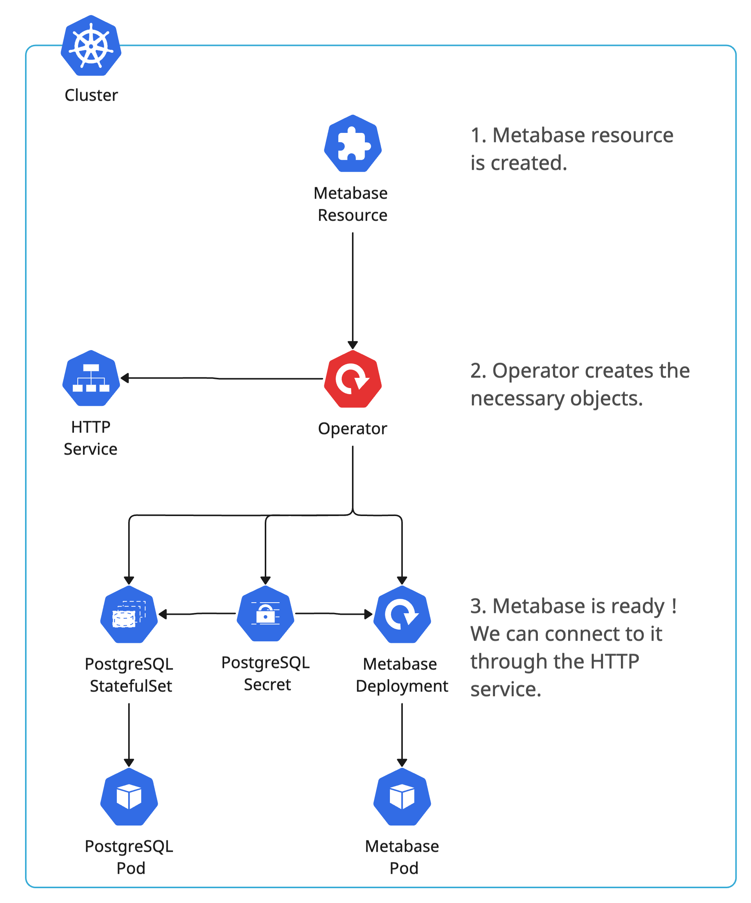

# Operator Overview
The operator watches `Metabase resources`. See the default operator behavior in the diagram below.
  

## **Pro Tips :bulb:**
1. Deleting the `Metabase resource` deletes the Metabase deployment, the PostgreSQL Statefulset and all other associated resources (secret, persistantVolumeClaim, ...).
2. You can create as much `Metabase resources` as you want. The limit is your cluster infrastructure.
3. The operator is a `Deployment`. You can debug by checking his pod logs.
4. Check status.ready of the `Metabase resource` to know when the Metabase is ready to accept connections.
5. Check status.host of the `Metabase resource` to establish a connection.